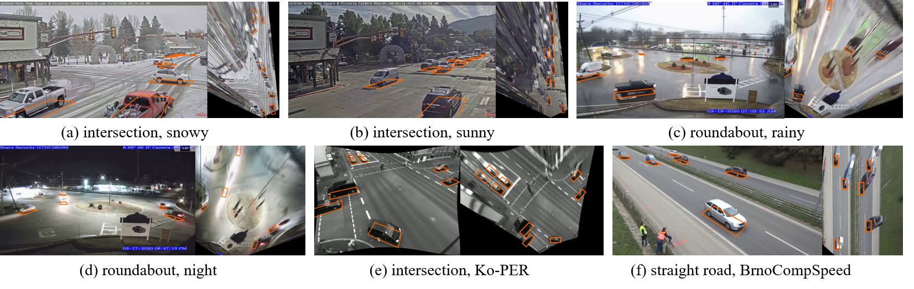

# Introduction

This directory contains the detection part of the code for the paper [**Monocular 3D Vehicle Detection Using Uncalibrated Traffic Cameras through Homography**](https://arxiv.org/pdf/2103.15293.pdf). It is developed based on the yolov3 [repo](https://github.com/ultralytics/yolov3) by Ultralytics. 

# Dependency
This repo also relies on another repo of mine for the bird's-eye-view related processing: [bev](https://github.com/minghanz/bev). The package can be built from source by running: 
```
python setup.py develop
```
at the root of the bev repo. 
# Inference
1. Download the pretrained weights at: [Google drive link](https://drive.google.com/file/d/1AwEzxIytaGDX8WVrvQ_3qc1WHM2oNpdW/view?usp=sharing), and put it under `weights` folder
2. Download the example data to test on: [Google drive link](https://drive.google.com/file/d/1Ggw3KKqoCxcSgeHzPZ-tudnGB7JlzNwf/view?usp=sharing), unzip the file. It is a subset of [BrnoCompSpeed](https://github.com/JakubSochor/BrnoCompSpeed) dataset. The zip file contains some post-processing so that the file structure is slightly different from the original dataset. The file structure of datasets assumed by this repo is described in `dataset_format.txt`. 
3. Modify the `--source` argument in `run_detect.sh` as the path to the downloaded example data folder. Specify `--output` as the path where you want it to output. Run the network to inference on the data:
```
./run_detect.sh
```